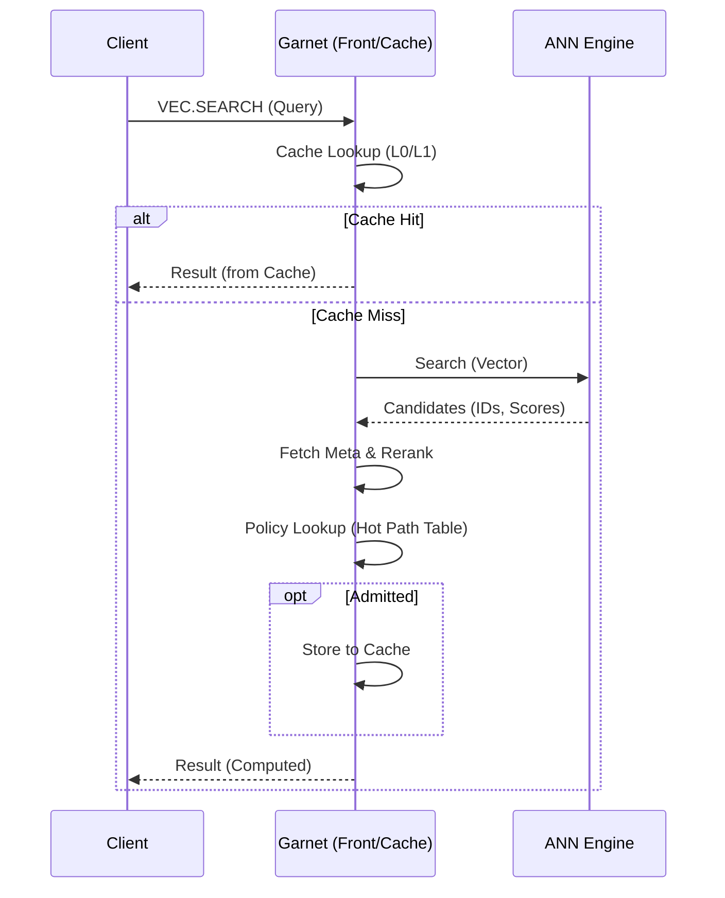
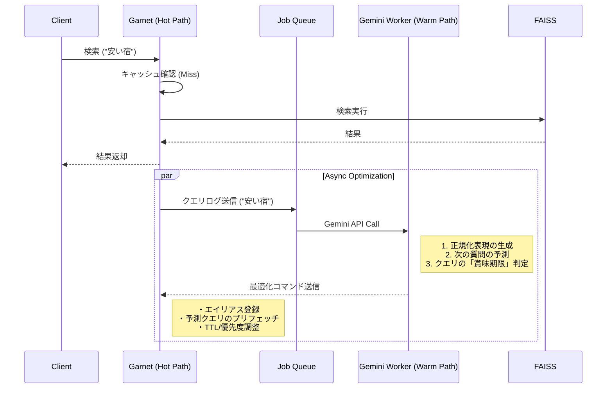
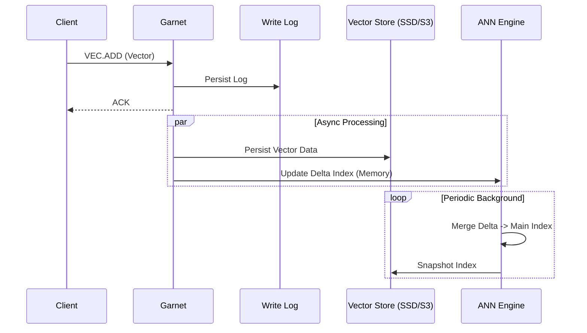

要点

* 「AIキャッシュ制御」まで含めたベクターDBとして、API・データモデル・学習/推論・運用/課金・SLOまで一通り定義した"完全版"の機能仕様書です
* **製品の正体**: 「AIアプリケーションのための検索コスト削減エンジン」
  * キャッチコピー: "AI検索のコストを50%削減、レスポンスを3倍高速に"
  * RAG/類似検索のP99と計算コスト（GPU秒）を制御する検索基盤
* 実装は Garnet をフロント(低遅延K/V＋拡張コマンド)に、FAISS をANNエンジンに、AIをキャッシュポリシーに適用する前提で記述します

---

# AIキャッシュ制御型ベクターDB 完全機能仕様書（Garnet × FAISS）

## 0. 用語

* ベクター: 埋め込みベクトル（float32/float16/int8 など）
* ANN: Approximate Nearest Neighbor（近似最近傍探索）
* QueryKey: クエリをキャッシュのキーにするための正規化・量子化表現
* CanonicalKey: LLMの意味正規化で生成する代表キー（同義語/表記揺れを吸収）
* CacheEntry: 検索結果や中間表現のキャッシュレコード
* Admission: キャッシュに入れるかの判定
* Eviction: キャッシュから追い出す判定
* TTL: 有効期限
* SLO/SLA: 目標/保証指標（レイテンシ、可用性など）
* LLM Worker: Gemini等の外部LLMを使う非同期最適化プロセス（Hot Pathには入れない）

---

## 1. プロダクト概要

### 1.1 目的

* 類似検索（topK）を低遅延・高スループットで提供し、特にP95/P99を安定させる
* ANN計算（CPU/GPU）や再ランキング等の下流コストを抑える
* 検索ワークロードの偏り（人気クエリ、近傍クエリの連打）をAIキャッシュ制御で吸収する

### 1.2 非目的

* 一般用途の分散K/V（ただし管理/メタ用途でK/V機能は使う）
* 強い分散トランザクション（MVP〜1st GAは最終整合が基本）
* 全ての複雑なフィルタ（初期は「効くフィルタ」に限定）

### 1.3 想定ユーザー（ペルソナ）

* ML/検索基盤エンジニア: FAISS/ANNチューニングと運用を簡単にしたい
* RAGプロダクトチーム: P99悪化でUXが壊れる、コストが高い
* SRE/Platform: SLA、ノイジーネイバー、監視と復旧手順が欲しい
* 経営/FinOps: GPU秒・CPU秒とリクエスト単価を下げたい

---

## 2. 提供形態（事業化前提）

* OSS Core（必須）: 基本検索、インデックス管理、基本キャッシュ（固定LRU等）
* 商用 Pro: AIキャッシュ制御、SLOガードレール、運用UI、アラート、マルチテナントQoS
* Enterprise: 高度な監査、SSO、暗号鍵管理、テナント別モデル、DR/マルチリージョン、専用サポート

（本仕様は全機能を記述。実装時はプラン別にフラグで制御）

---

## 3. システム構成

### 3.1 論理コンポーネント

1. Front/Cache Layer（Garnet）

* コマンド受付（RESP互換を推奨）
* 結果キャッシュ／中間キャッシュ／メタキャッシュ
* ポリシー推論（低コスト推論を基本、重い推論は別プロセス）
* レート制御、認証、テナント分離

2. ANN Engine（FAISS）

* インデックス作成・学習・検索
* CPU/GPUのいずれか（構成で選択）
* **Delta Indexing Strategy**:
    * `Head Index`: 小規模・可変 (HNSW/Flat)。リアルタイム更新用。
    * `Tail Index`: 大規模・不変 (IVF-PQ等)。バックグラウンドでHeadをLog-Structured Merge (LSM) 的にTailへ統合。
    * 検索時は Head + Tail の結果をマージ。

3. AI Cache Controller（2段階アーキテクチャ）

* **Hot Path（同期パス）**: ルールベース判定 + 軽量スコアリング（Garnet内部にロードされた軽量ポリシー）
  * 遅延: < 0.1ms目標（AI推論ではなく、Warm Pathが更新したLookup Table/Bloom Filter/軽量決定木を参照）
  * admission/eviction/TTLの高速判定
  * 推論結果の確率的キャッシュで再利用
* **Warm Path（非同期パス）**: AI Controller (Python/ONNX) サイドカー
  * 遅延: 10ms ~ 50ms (許容範囲)
  * 複雑なポリシー判定、特徴量集計、Hot Path用ルールの更新生成
  * 結果はHot Pathのポリシーテーブルにフィードバック
  * LLM Worker（Gemini API）: 意味正規化/プリフェッチ予測/追い出し助言を非同期ジョブで実行し、CanonicalKeyMapやPrefetch Queue/TTL上書きを更新
* 学習: ログ収集→特徴量生成→評価→デプロイ (Pythonサイドカーで学習しONNX/ルールをエクスポート)
* ガードレール:
  * Warm Path応答遅延時はHot Pathのキャッシュ済みルール/LRUへ安全にフォールバック
  * LLM利用はヘッドクエリ/高コスト/高ミスに限定し、QPS/コスト上限を設定

4. Persistent Storage

* ベクター本体永続化（object storage/SSD）
* インデックススナップショット
* メタデータストア（小規模ならGarnet内、規模で外部DB）

### 3.2 データフロー

#### 検索フロー (Search)

#### 非同期最適化フロー（Warm Path / LLM）

#### 書き込みフロー (Write)

* 書込: client → front → write log/queue → vector store → faiss update (Delta) → cache invalidate/ttl調整
* 検索: client → front
  * cache hit: frontで返す
  * miss: faiss検索→返却→AI判定→必要ならキャッシュ格納

---

## 4. データモデル仕様

### 4.1 ベクターレコード

* tenant_id: string
* index_name: string
* id: string（ユニーク）
* vector:

  * dtype: fp32/fp16/int8（構成で許可）
  * dim: int
  * payload: bytes（内部表現は列指向を推奨）
* meta: JSON（サイズ上限あり）
* tags: string[]（高速フィルタ用）
* numeric_fields: map<string, float|int>（簡易レンジ条件用）
* version: int64（楽観ロック/世代管理）
* created_at, updated_at
* deleted: bool（論理削除）

制約

* id最大長、meta最大バイト、タグ数上限
* tenant_id / index_name は `[A-Za-z0-9_-]+`（英数字と _ - のみ）
* dimはindex単位で固定

### 4.2 インデックス定義（IndexConfig）

* tenant_id
* index_name
* dim
* metric: cosine|ip|l2
* index_factory: string（例: “IVF65536,PQ64” 等）
* train:

  * train_sample_size
  * train_source: random|stratified|provided_ids
* update_mode:

  * realtime|microbatch|offline
* shard:

  * shard_count
  * routing: hash|range|custom
* faiss_params_default:

  * nprobe, efSearch, etc
* version_epoch: int64（世代。キャッシュ無効化の基点）
* created_at, updated_at

### 4.3 キャッシュエントリ（CacheEntry）

共通フィールド

* tenant_id, index_name
* cache_type: result|candidate|cluster|pqcode|meta
* key: bytes（QueryKeyまたはIDキー）
* value: bytes（圧縮可能）
* created_at
* expire_at
* hit_count
* last_access_at
* size_bytes
* epoch: int64（index世代）

結果キャッシュ（result）のvalue構造（例）

* topK: int
* ids: string[topK]
* scores: float[topK]
* distances: float[topK]（任意）
* meta_snippet: bytes（任意）
* debug: {faiss_params_used, latency_breakdown}（任意）

### 4.4 Semantic Key Alias Map（CanonicalKeyMap）

* tenant_id, index_name
* alias_key: bytes（QueryKeyまたはテキストハッシュ）
* canonical_key: bytes（CanonicalKey）
* confidence: float
* source: llm|rule|manual
* updated_at
* expire_at
* hit_count

用途

* Cache Lookup前に alias_key → canonical_key を解決し、L0/L1のヒット率を向上
* Warm Path/LLM が更新し、Hot Path では参照のみ

---

## 5. API仕様

### 5.1 プロトコル

* データプレーン: RESP互換コマンド（推奨）
* コントロールプレーン: HTTP/JSON（管理・運用・課金・監視）

### 5.2 データプレーンコマンド（詳細）

#### ベクター操作

* `VEC.ADD tenant index id VECTOR <bin> [META <json>]`
    * 例: `VEC.ADD my_app main_idx "doc1" VECTOR \x00\x00... META {"category":"news"}`
    * Response: `OK` or Error

#### 検索

* `VEC.SEARCH tenant index TOPK <k> VECTOR <bin> [PARAMS...]`
    * 例: `VEC.SEARCH my_app main_idx TOPK 10 VECTOR \x00... FILTER "category == 'news'"`
    * Response (Array):
        1. (Array) Hits: `[[id, score, dist, meta], ...]`
        2. (Map) DebugInfo: `{ "cache_hit": true, "latency_ms": 1.2, "ai_decision": "admit" }`

#### エラーコード体系

| Code | Description | Action |
|---|---|---|
| `VEC_OK` | 成功 | - |
| `VEC_ERR_DIM` | 次元数不一致 | 入力ベクターを確認 |
| `VEC_ERR_NOT_FOUND` | Index/Tenantが存在しない | 作成を確認 |
| `VEC_ERR_QUOTA` | テナントQuota超過 | プラン確認/Wait |
| `VEC_ERR_BUSY` | システム高負荷 (Shedding) | リトライ (Backoff) |

### 5.3 管理API（HTTP）

* POST /v1/indexes

* POST /v1/indexes/{id}/build

* POST /v1/indexes/{id}/snapshot

* POST /v1/indexes/{id}/load

* GET  /v1/indexes/{id}/stats

* POST /v1/tenants

* GET  /v1/tenants/{id}/quotas

* PUT  /v1/tenants/{id}/quotas

* GET  /v1/cache/policies

* PUT  /v1/cache/policies

* POST /v1/cache/flush

* POST /v1/cache/invalidate

* GET  /v1/ai/models

* POST /v1/ai/models/train

* POST /v1/ai/models/deploy

* POST /v1/ai/models/rollback

* GET  /v1/ai/evaluations

* GET  /v1/billing/usage

* GET  /v1/health

* GET  /v1/metrics（Prometheus）

---

## 6. 検索仕様（アルゴリズムと振る舞い）

### 6.1 類似度計算

* cosine: 正規化前提（index作成時に正規化するか、クエリ時に正規化するかを設定）
* ip: 内積（スケールに注意）
* l2: ユークリッド距離

### 6.2 検索パイプライン（標準）

1. 入力検証（dim、dtype、tenant認可）
2. QueryKey生成（後述）
3. キャッシュルックアップ（result→candidate→cluster…の順）
4. ミス時: FAISSに問い合わせ
5. 結果整形（必要に応じてmeta join）
6. Hot Pathポリシー参照（Warm Pathが更新したLookup Table/Bloom Filter）
7. キャッシュ格納（admittedなら）
8. 応答

※ LLM（Gemini）による意味正規化/予測/TTL助言は非同期で実行し、検索パイプラインをブロックしない。

### 6.3 フィルタ適用

* 推奨: 事前にフィルタで候補を絞れる仕組み（タグでシャードを分ける等）
* 初期実装: フィルタは「検索後フィルタリング」も許容（ただし上限/警告）
* フィルタでtopK不足の場合:

  * 再探索（候補数増）か
  * 不足返却（設定可能）

---

## 7. キャッシュ仕様（AI制御を含む）

### 7.1 キャッシュ階層

* L0: result cache（QueryKey → topK結果）
* L1: candidate cache（QueryKey → 候補集合やdoclist）
* L2: routing cache（QueryKey → IVFクラスタID、検索パラメータ推奨）
* L3: meta cache（id → meta一部）

構成でON/OFF可能。メモリ上限はテナント/全体で設定。

### 7.2 QueryKey生成仕様（3段階）

目的: 「同じクエリ」だけでなく「近いクエリ」も再利用対象にする

**Level 0: 完全一致（デフォルト・推奨）**
* クエリベクターHash + フィルタ条件 + topK + metric
* 誤キャッシュリスク: なし
* 最初に実装、ヒット率測定後に段階的に緩和

**Level 1: 許容誤差**
* ベクター量子化（512次元→64bit SimHash）
* topK丸め（5/10/20/50/100）
* 誤キャッシュリスク: 低（類似結果を返す可能性）

**Level 2: Semantic Clustering（上級）**
* クエリ埋め込みをクラスタリング（128〜256クラスタ）
* 各クラスタに代表結果をキャッシュ
* 誤キャッシュリスク: 中（設定可能な閾値で制御）

パラメータ

* query_key_level: 0|1|2（テナント/index単位で設定）
* 量子化の粗さ（Level 1/2）
* filterをQueryKeyに含める範囲（タグのみ含める等）
* semantic_normalization_enabled: bool
* canonical_key_ttl_seconds: int
* llm_min_query_count: int
* llm_min_proxy_cost: float

**Warm Path補足: Semantic Cache Key Normalization（LLM）**

* クエリ文字列/メタがある場合に、LLMで同義語・表記揺れを吸収したCanonicalKeyを生成
* `CanonicalKeyMap` を更新し、Hot Pathはalias解決後にL0/L1を参照
* ベクターのみでテキストが無い場合はスキップ
* 反映は非同期で、検索パスをブロックしない

### 7.3 Admission（格納判定）

入力

* query特徴量、tenant、負荷、推定コスト、直近ヒット状況

出力

* admit: bool
* ttl_seconds
* cache_type（resultだけ/中間も/両方）
* prefetch_action（任意）

ポリシー

* 低コスト検索はキャッシュしない場合がある
* 同一/近傍クエリが短時間に繰り返される場合は積極的にキャッシュ
* テナント別予算（cache budget）を超えない

### 7.4 Eviction（追い出し）

基本はスコアリング

* value_score = E[future_hits] * saved_cost_per_hit - memory_penalty - staleness_penalty
* saved_cost_per_hit: **Proxy Cost Metric** (例: `nprobe * (avg_cluster_size / total_vectors)`)。実測CPU/GPU時間は変動が激しいため、安定した計算量モデルを使用。
* memory_penalty は size_bytes とテナント予算から

実装

* まずは LRU/LFU + 重み付け
* Warm PathのLLMがバッチでTTL/evict_priorityの上書きを提案（時事性/普遍性の判定）
* ProでAIスコア（回帰/GBDT/バンディット）に置換可能

### 7.5 TTL制御

可変TTL

* 更新頻度が高い index は短め
* ドメインドリフトが強いクエリは短め
* “熱い”クエリは長め
* LLM助言で時事性/普遍性を評価しTTL補正（非同期）
* **Semantic TTL**: ベクター空間の特定クラスタにデータ追加が集中した場合（Drift検知）、そのクラスタ近傍のキャッシュTTLを自動短縮

強制失効

* index epoch が変わったら epoch不一致のキャッシュは無効

### 7.6 Partial caching（中間キャッシュ）

* route cache: (QueryKey→nprobe/efSearch推奨)
* cluster cache: (QueryKey→IVFクラスタ候補)
* candidate cache: (QueryKey→候補ID集合)
* 効果: 検索を完全に省略できない場合でも計算量を削減

### 7.7 キャッシュ整合性

* 基本: TTL + epochで担保（更新直後は古い結果が返る可能性あり）
* オプション:

  * id更新/削除時に関係キャッシュを部分無効化（高コストなのでEnterprise向け）

---

## 8. AIモデル仕様（学習・評価・配備）

### 8.1 目的

* レイテンシ（特にP99）とコスト（CPU/GPU秒）を同時に最適化
* ノイジーネイバーを抑制し、テナント公平性を維持

### 8.2 モデルの入出力

入力特徴量（例）

* query: QueryKey、量子化コード統計、norm、topK、filterタイプ
* system: QPS、キュー長、CPU/GPU使用率、メモリ圧迫
* history: hit率、再訪間隔、直近の同種クエリ頻度
* cost: 推定FAISS時間、推定候補数、faiss params
* tenant: プラン、優先度、予算、SLO

出力

* admit(bool)、ttl、cache_type、evict_priority、prefetch指示、faiss params推奨

### 8.3 学習方式

* Phase A: ルール + 線形/GBDT（オフライン学習）
* Phase B: contextual bandit（オンラインで微調整）
* Phase C: テナント別モデル、あるいはクラスタ別モデル

### 8.4 評価指標（オフライン）

* 期待コスト削減: Σ(saved_cost)
* 期待P99改善（シミュレーション）
* キャッシュ占有率と追い出し回数
* 誤差コスト（古い結果返却の影響は別途）

### 8.5 安全装置（ガードレール）

* 最低ヒット率/最大メモリ/最大TTL
* P99悪化検知で即フォールバック（ルール/LRUへ）
* カナリアデプロイ（tenantの一部で試す）
* ロールバック（モデルversion指定で即時）

---

## 9. マルチテナント仕様（事業化の核）

### 9.1 分離

* namespace強制（tenant_idは必須）
* 認可: tenantごとにindex/操作権限
* 監査ログ: 管理操作・書き込みは全て記録

### 9.2 QoS/クォータ

* tenant別

  * QPS上限
  * 同時実行数
  * キャッシュメモリ上限
  * 1日あたり検索回数 or CPU/GPU秒上限（課金連動）

### 9.3 ノイジーネイバー対策

* 優先度付きスケジューリング
* P99危険時:

  * 低優先テナントの検索パラメータを落とす
  * 低優先テナントのadmissionを厳しくする
* バースト制御（短時間の急増は許容、長時間は抑制）

---

## 10. 運用・監視・SRE仕様

### 10.1 SLO/SLA（例）

* 可用性: 99.9%（Pro）、99.95%（Enterprise）
* レイテンシ（検索）

  * cache hit: P99 < 2ms（同一AZ内想定）
  * cache miss: P99 < 50ms（規模・index依存、SLOはプラン別）
* データ耐久性: スナップショット + WAL/ログで復旧

### 10.2 メトリクス（Prometheus形式）

* **検索 (Search)**
    * `vector_db_search_latency_seconds_bucket{tenant, index, hit_status}`
    * `vector_db_search_requests_total{tenant, index, status}`
* **キャッシュ (Cache)**
    * `vector_db_cache_hit_total{tenant, index, layer}`
    * `vector_db_cache_eviction_total{tenant, index, reason}`
    * `vector_db_cache_memory_bytes{tenant}`
* **FAISS**
    * `vector_db_faiss_latency_seconds_bucket{tenant, index}`
    * `vector_db_faiss_queue_depth`
* **AI Controller**
    * `vector_db_ai_inference_latency_seconds_bucket`
    * `vector_db_ai_decision_total{decision="admit|reject"}`
    * `vector_db_ai_fallback_total`
* **LLM**
    * `vector_db_llm_job_latency_seconds_bucket{type="normalize|prefetch|evict"}`
    * `vector_db_llm_job_total{type="normalize|prefetch|evict", status="ok|err|skipped"}`
    * `vector_db_llm_budget_dropped_total`

### 10.3 トレーシング

* request_idで front→cache→faiss→policy の内訳を返却可能（TRACEオプション）
* 遅延の上位要因（cache miss率、faiss遅延、meta joinなど）を可視化

### 10.4 アラート

* P99超過（連続n分）
* hit率急落
* eviction暴発（スラッシング）
* faissキュー長増大
* メモリ逼迫
* AIフォールバック頻発

### 10.5 運用アクション（Runbook）

* P99悪化時:

  1. CACHE_HINT=force を有効化（SLOモード）
  2. faiss params自動デグレード（nprobe/efSearch低下）
  3. admissionを厳しくしてメモリ圧迫を下げる
  4. 低優先テナントの制限
* モデル異常時:

  * AI無効化→ルール/LRUへ即切替
  * 直前モデルへロールバック

---

## 11. セキュリティ仕様

* 認証: APIキー / mTLS / OIDC（Enterprise）
* 認可: RBAC（tenant admin / operator / reader）
* 暗号化:

  * 通信TLS
  * 永続データの暗号化（KMS連携はEnterprise）
* 監査ログ:

  * index作成/削除、スナップショット、ポリシー変更、モデル切替、クォータ変更

---

## 12. バックアップ・復旧（DR）

* スナップショット

  * index snapshot（FAISS）
  * vector store snapshot（ベクター本体）
  * policy/model metadata
* 復旧目標（例）

  * RPO: 15分（Pro）、5分（Enterprise）
  * RTO: 1時間（Pro）、15分（Enterprise）

---

## 13. 課金・メータリング仕様（事業化必須）

### 13.1 計測単位

* requests: 検索リクエスト数
* compute: CPU秒 / GPU秒（推定でも可）
* storage: 永続ベクター容量、スナップショット容量
* cache: メモリ予約量（プランに含める/超過課金）

### 13.2 課金モデル例

* Pro: 月額 + 上限付き従量（requests or compute）
* Enterprise: 予約（コミット）+ 超過

### 13.3 請求に耐えるログ

* tenant別に集計可能
* 改ざん防止（監査要件があれば署名/別ストア）

---

## 14. 互換性・制限

### 14.1 互換性

* RESP互換で既存Redisクライアントを流用可能（ただし独自コマンドは要対応）
* ベクター形式

  * float配列（JSON）とバイナリ（推奨）を両対応可能

### 14.2 制限（初期の現実ライン）

* filter DSLは機能制限（高速評価できるもののみ）
* 強整合モードは限定提供（Enterpriseのオプション）
* 高頻度更新と高精度を両立するindex種別は制約あり（構成でガイド）

---

## 15. 受け入れ基準（Acceptance Criteria）

機能

* 10万/100万/1000万ベクターで、ADD/SEARCH/DELが仕様通り動作
* epoch更新でキャッシュが正しく無効化される
* admission/ttlが設定通り反映される
* AI無効化でL RUへフォールバックし、サービス継続

性能

* hit時P99、miss時P99が目標範囲に収まる（構成別SLOで）
* 高負荷時のレート制御が機能し、システムが落ちない

運用

* 主要メトリクスが取得でき、アラートが鳴る
* スナップショットから復旧できる
* テナントクォータが守られる

---

## 16. 実装の最小分割（参考：完全仕様→実装優先度）

* Must（最初に作る）

  * VEC.ADD/UPSERT/DEL/SEARCH
  * result cache（完全一致QueryKey Level 0）+ epoch無効化
  * 固定LRU + ルールadmission/ttl
  * メトリクス/トレースの基礎
  * コスト推定・記録（メータリングの基盤）

* Should（事業化に必要）

  * マルチテナントクォータ/QoS
  * Cost-Aware Semantic Cache（クラスタベース）
  * SLOガードレール（自動デグレード）
  * メータリング（課金計測）
  * Cost-Aware Query Routing

* Could（差別化の上積み）

  * partial caching（candidate/route）
  * AI Policy（オフライン学習 + A/Bテスト切替）
  * Query Prediction & Prefetch
  * AI-Driven Semantic Optimization（LLM: 正規化/プリフェッチ/追い出し助言）
  * テナント別モデル
  * Hybrid Search（Dense + Sparse融合）
  * 高度な監査/SSO/DR

---

## 17. 差別化機能（新規提案）

### 17.1 Cost-Aware Semantic Cache

**目的**: FAISS計算の30-50%削減、P99レイテンシ 50ms→15ms

**仕組み**:
1. クエリ埋め込みをクラスタリング（128〜256クラスタ）
2. 各クラスタに代表結果をキャッシュ
3. 新規クエリ → 最近クラスタの結果を「候補」として返却
4. 候補が十分近ければ、FAISS検索をスキップ

5. 「十分近い」の閾値はコスト（Proxy Cost）と品質のトレードオフでAI調整。コストが高いクエリほど、キャッシュ利用の閾値を緩める。

**設定パラメータ**:
* semantic_cache_enabled: bool
* cluster_count: int (128-512)
* similarity_threshold: float (0.85-0.95)
* fallback_on_miss: bool

---

### 17.2 Cost-Aware Query Routing

**目的**: テナント予算を守りながら検索品質を最適化

**仕組み**:
1. クエリ到着時にコスト予測:
   * 推定FAISS時間、結果サイズ、テナント予算残り
2. コスト高すぎる場合は品質を自動調整:
   * nprobe/efSearch低下
   * topK制限
   * キャッシュ候補で代替
3. 調整内容はレスポンスに明示（透明性）

**差別化ポイント**: Pinecone等は固定品質 or 手動設定のみ

---

### 17.3 Query Prediction & Prefetch

**目的**: RAG用途でレイテンシを劇的に改善（ユーザーが次に入力する質問の答えを裏で用意）

**仕組み**:
1. ユーザーセッションの過去クエリからパターン学習
2. 次に来そうなクエリの結果を事前計算（Prefetch）
3. 特にRAG用途で効果大（会話の文脈から予測可能）

**実装アプローチ**:
* オフライン: クエリログから **Frequent Itemset Mining (FIM)** または Sequence Model で「共起/順序パターン」を抽出
* オンライン:
    * **Next-Query Prediction Table** (Garnet K/V) を参照
    * ユーザーの直前クエリIDをキーに、高確率な次クエリ候補をO(1)で取得
    * アイドル時間に候補を検索しキャッシュへFill
* LLM（Gemini）併用時は Warm Pathで非同期推論し、予測テーブルを補完（高価値クエリのみ適用）

---

### 17.4 Hybrid Search（v1.1以降）

**目的**: Weaviate対抗、キーワード+ベクター検索の融合

**仕組み**:
* Dense Vector + Sparse Vector（BM25/SPLADE）のスコア融合
* 融合係数α（0=キーワードのみ、1=ベクターのみ）
* α自動調整（クエリ種別をAIが判定）

---

### 17.5 AI-Driven Semantic Optimization（Gemini / Warm Path）

**前提**: Hot Pathの目標遅延は < 0.1ms のため、Gemini APIを同期パスに入れない。GeminiはWarm Path/バックグラウンド専用。

**適用領域**:

A. Semantic Cache Key Normalization（非同期正規化）
* 同義語・表記揺れを吸収し、CanonicalKeyを生成
* `CanonicalKeyMap` を更新してキャッシュヒット率を上げる

B. Intelligent Prefetching for RAG（文脈予測）
* セッション文脈から次の質問を推論し、事前にFAISS検索→キャッシュ
* 体感レイテンシを0msに近づける

C. Cache Eviction Policy Advisor（賢い追い出し）
* バッチで「時事性/普遍性」を評価し、TTL/優先度を調整
* LRUだけでは守れない価値の高いクエリを残す

**実装案**:
1. Frontがクエリログ/統計をQueueへ送信
2. Gemini Workerが推論し、CanonicalKeyMap/Prefetch Queue/TTL Overrideを更新
3. Hot Pathはテーブル参照のみで即応（同期パスは汚さない）

**FinOpsガードレール**:
* Head Query（頻出）または高コスト・高ミスクエリのみ適用
* `llm_min_query_count` / `llm_min_proxy_cost` でフィルタ、QPS/費用上限でレート制御
* 失敗時は無視/リトライでHot Pathに影響させない

---

### 17.6 High-Performance Optimizations（v1.2以降）

**目的**: 市場のベクターDB（Qdrant, Milvus, Redis）と競合するため、低レベルの性能最適化を実施。

**A. SIMD & Memory Optimization**

*   **距離計算のSIMD化**: `System.Runtime.Intrinsics.Vector256<float>` (AVX2) / `Vector512<float>` (AVX-512) を使用し、L2/Cosine/IP距離計算を4-8倍高速化。
*   **Off-Heap Memory**: HNSWグラフノードを `NativeMemory` または Pinned Memory で管理し、GCストップタイム (STW) を削減。ノード間のポインタチェイシングを抑え、CPU L1/L2キャッシュヒット率を向上。
*   **Bounds Check Elimination**: `unsafe` コードブロックとポインタ演算により、配列境界チェックのオーバーヘッドを排除。

**B. Disk-Based HNSW (Tsavorite Integration / DiskANN)**

*   **目的**: メモリ容量を超える大規模データセット（10億ベクトル超）をサポート。
*   **仕組み**: Garnet が内包する **Tsavorite (旧 FASTER)** ハイブリッドログストレージエンジンを活用。
    *   HNSWのグラフノードをメモリとSSD間で自動的にページング。
    *   ホットなノード（頻繁にアクセスされるレイヤー0）はメモリに保持し、コールドなノードはディスクから読み取り。
    *   Microsoft Research の DiskANN 論文をベースに、SSD I/O 特性に最適化したノード配置戦略を実装。
*   **期待効果**: メモリ使用量をデータセットサイズの10-20%に抑えつつ、ミリ秒オーダーの検索レイテンシを維持。

**C. Native RESP Vector API (Zero-Copy Networking)**

*   **目的**: HTTP (ASP.NET Core) のオーバーヘッド（JSONシリアライズ、HTTPハンドシェイク）を排除し、ピーク性能を最大化。
*   **仕組み**:
    *   `VEC.SEARCH` / `VEC.ADD` 等のベクターコマンドを、Garnet の RESP パイプラインで直接処理。
    *   クエリベクタおよび結果ベクタに **ゼロコピーバッファ** を適用し、メモリコピーを最小化。
    *   Garnet の高効率 I/O スタック（io_uring / epoll）をフル活用。
*   **期待効果**: HTTP API比で 2-3倍のスループット向上。

---

## 18. 競合比較表

| 機能 | 本製品 | Pinecone | Milvus | Weaviate |
|------|--------|----------|--------|----------|
| AIキャッシュ制御 | ✅ 独自 | ❌ | ❌ | ❌ |
| Semantic Cache | ✅ Cost-Aware | ❌ | ❌ | ❌ |
| SLOガードレール | ✅ Pro | ❌ | ❌ | 部分的 |
| コスト可視化 | ✅ 詳細 | 請求のみ | 自己管理 | ❌ |
| セルフホスト | ✅ | ❌ | ✅ | ✅ |
| Hybrid Search | v1.1 | ❌ | ✅ | ✅ |
| Query Prediction | ✅ | ❌ | ❌ | ❌ |
| Cost-Aware Routing | ✅ | ❌ | ❌ | ❌ |
